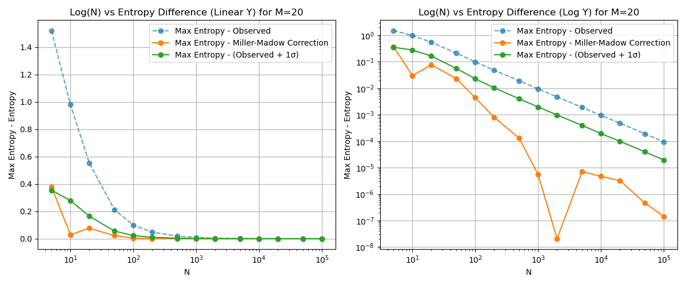
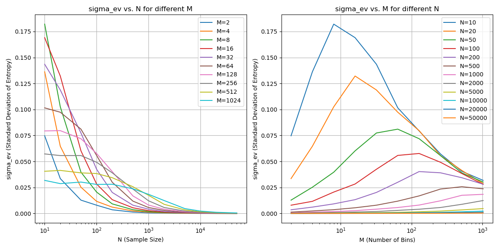
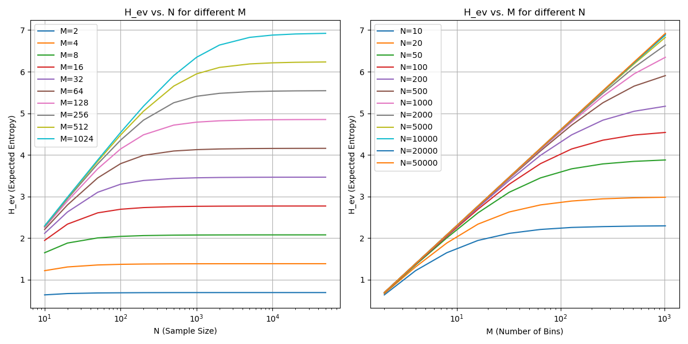
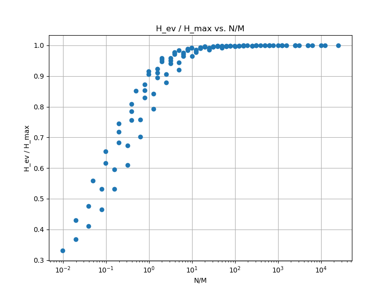
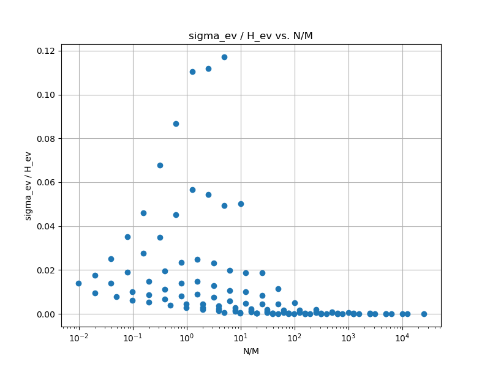

# Final Report: Entropy Estimation and Model Refinement

## 1. Introduction

This project aimed to explore entropy estimation techniques for probabilistic model refinement. In particular, we faced challenges related to finite sample sizes, where entropy estimates are known to be biased. Initially, a series of experiments were designed to assess entropy through histogram-based methods, but the results were poor, particularly for small sample sizes.

Upon further investigation, the **Miller-Madow correction** was chosen as the optimal approach to address the bias caused by small sample sizes. This correction adjusts entropy estimates for finite samples, making it particularly useful when sample sizes are small relative to the number of bins, as in our case.

## 2. Experimentation Overview

### 2.1 Initial Experimental Setup

The initial experiments aimed to estimate entropy from uniformly distributed histograms, using varying numbers of bins \(M\) and sample sizes \(N\). However, the results indicated significant underestimation of entropy, particularly when the number of samples was small relative to the number of bins. This underestimation posed a challenge for model comparison and refinement, where accurate entropy estimates are crucial.

### 2.2 Pivot to Miller-Madow Correction

Given the shortcomings of initial experiments, further investigation into entropy bias correction methods led to the adoption of the **Miller-Madow correction**. This correction adjusts the naive entropy estimate by adding a bias term that accounts for the underestimation in small sample sizes. The correction works well in situations where the number of samples is small relative to the number of bins, as it over-corrects for small \(N\), which aligns with our goal of biasing against small \(N\) for model refinement.

## 3. Results and Discussion

### 3.1 Entropy Estimation with Miller-Madow Correction

After applying the Miller-Madow correction, entropy estimates showed significant improvement, particularly for smaller sample sizes. The corrected entropy values were closer to the theoretical maximum, indicating a more accurate estimation of the true entropy.

#### Entropy Difference (Observed vs. Corrected)

The following figures show the entropy differences between the observed values and those corrected using the Miller-Madow method. These figures highlight how the correction brings entropy estimates closer to the theoretical maximum as the sample size \(N\) increases.

#### Standard Deviation of Entropy

The standard deviation of the entropy estimate was also analyzed, providing insight into the uncertainty associated with different sample sizes and bin counts. The correction reduced the standard deviation, indicating more reliable estimates.

#### Expected Entropy

We also analyzed the expected entropy across different values of \(M\) and \(N\), demonstrating how the Miller-Madow correction improves the accuracy of entropy estimates.

### 3.2 Asymptotic Behavior of Entropy Estimation

The behavior of the expected entropy and variance was analyzed across different values of \(N/M\). As the ratio \(N/M\) increases, the entropy estimate approaches the maximum value, and the variance decreases.

## 4. Conclusion

The adoption of the **Miller-Madow correction** significantly improved entropy estimation in our experiments. By correcting the bias in small sample sizes, the correction provided more accurate entropy estimates, especially for scenarios where \(N\) is small relative to \(M\). This aligns with our goal of refining models based on entropy, particularly in cases where smaller models should be biased against.

Future work could explore more advanced correction techniques for different types of data distributions or refine the Miller-Madow method further for specific use cases in machine learning and model evaluation.

## 5. References

- Miller, W. G., & Madow, W. G. (1944). On the limiting distributions of estimates based on samples from finite universes. *The Annals of Mathematical Statistics*.
- Other relevant references can be included here.
